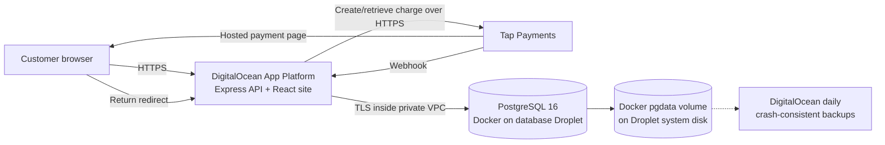
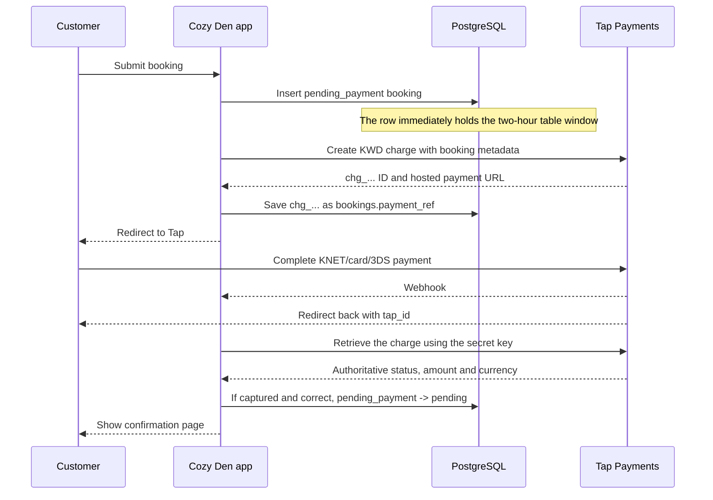

# Cozy Den Database and Payments Guide

Audit date: 5 August 2026
Scope: production application code, DigitalOcean App Platform configuration, DigitalOcean database Droplet, live PostgreSQL schema and aggregate data. The inspection was read-only and did not expose customer names, email addresses, verification codes, payment identifiers, or credentials.

Remediation update, 5 August 2026: the payment-expiry race and missing ledger described below were fixed in migration 018 and the accompanying application changes. Tap charges now expire after 20 minutes, the local table hold lasts 30 minutes, late captures enter an explicit review state, provider observations are deduplicated, and the six historical cancelled charge references are reconciled automatically. The Droplet was also patched, rebooted, and verified with zero pending updates.

## Executive summary

Cozy Den's database is online, healthy, encrypted in transit from the application, and small enough that its current server has plenty of capacity. The booking design has several good protections: PostgreSQL prevents overlapping table reservations atomically, the application does not trust browser or webhook claims about payment, and Tap charges are re-fetched and checked for the expected amount and KWD currency.

The system is a sound early-production booking system. The critical late-payment timing defect found during the audit has been removed, and new charges now have a dedicated current-state ledger plus a compact event history. It is still not a complete accounting system: refunds, chargebacks, gateway fees, payouts, recurring off-server backups, and stronger monitoring remain future work.

Current assessment:

- Database availability and integrity: **healthy**
- Network and connection security: **mostly good**
- Booking conflict prevention: **well implemented**
- Normal Tap confirmation flow: **well designed**
- Payment audit trail: **implemented for charge creation and state transitions**
- Refunds, chargebacks and payout reconciliation: **still need work**
- Backup/recovery protection: **basic, not sufficient for payment records**
- Overall production risk: **no known critical payment race; several resilience gaps remain**

## 1. How the production system is arranged



The public website and API run together as one App Platform service. PostgreSQL does not accept connections on its public address: Docker publishes port 5432 only on the Droplet's private VPC address, and the DigitalOcean cloud firewall permits database traffic only from the VPC. The observed App Platform connection to PostgreSQL used TLS. PostgreSQL uses SCRAM-SHA-256 password authentication for network clients.

The database runs in one `postgres:16-alpine` container named `cozy-den-db-1`. Its data lives in the Docker volume `cozy-den_pgdata`, which is stored on the Droplet's 25 GB system disk. There is no replica, automatic failover, separate block volume, or managed database service.

## 2. Live infrastructure snapshot

| Item | Observed state |
|---|---|
| Droplet region | Frankfurt (FRA1) |
| Server size | 1 GB RAM, 25 GB disk, 2 GB swap |
| Disk use | 7.6 GB of 25 GB (32%) |
| Available memory | Approximately 570 MB during inspection |
| Database image | PostgreSQL 16.14 on Alpine |
| Database size | Approximately 9.7 MB |
| Container health | Healthy, up 12 days, zero container restarts |
| PostgreSQL connections | 100 maximum; very low current use |
| PostgreSQL TLS | Enabled; live application connection verified as encrypted |
| Password storage | SCRAM-SHA-256 |
| WAL archiving / point-in-time recovery | Disabled / unavailable |
| DigitalOcean backups | Daily, seven rolling backups visible |
| Logical PostgreSQL backup job | None found |
| OS maintenance | Patched and rebooted; zero updates pending |

Capacity is not presently a concern. Resilience is: this is a single server and a single copy of the live database between backups.

## 3. What is stored in the database

Seventeen migrations are applied. The live database contained the following important record counts at the time of inspection:

| Area | Main tables | Live count or purpose |
|---|---|---|
| Bookings | `bookings`, `booking_items` | 13 bookings; no current line items |
| Seating | `tables` | 13 historical and active table records |
| Pricing | `pricing_rates`, `price_overrides` | One base-rate row and 20 dated overrides |
| Customers/auth | `users`, verification/reset tokens | 10 users; no active email/reset tokens |
| Content | `games`, `events`, `promos`, wanted-board tables | Site content and community posts |
| Staff audit | `staff_grants` | Four staff access audit events |
| Support | support requests/messages/status events | Support workflow history |
| Schema history | `schema_migrations` | 17 applied migration filenames |

### The booking record

Each booking stores:

- table and optional game
- service date and start time
- guest name and contact email
- a unique confirmation/verification code
- booking workflow status
- source (`online` or `staff_manual`)
- table fee, item total, and total as integers
- one optional `payment_ref`, currently the Tap charge ID
- creation timestamp

Migration 018 adds `payments` and `payment_events`: one compact current-state row per provider charge and one deduplicated event per distinct observed state. Dedicated refund and chargeback workflows remain future work.

### Booking statuses

| Status | Meaning in the current application |
|---|---|
| `pending_payment` | The two-hour table window is reserved while Tap payment is in progress. |
| `pending` | For an online booking, payment was treated as successful and the customer is expected to arrive. For a staff-created booking, it means reserved without an online payment. Check `source` to distinguish them. |
| `print_receipt` | Staff marked the customer as arrived; the dashboard asks staff to print the receipt. |
| `order_complete` | Staff completed the visit/order workflow. |
| `cancelled` | The payment attempt failed, the local hold expired, charge creation failed, or an old data-cleanup migration cancelled a collision. It does **not** record which reason occurred. |

Cancelled rows do not block availability. PostgreSQL uses a GiST exclusion constraint over the actual two-hour time range, so simultaneous requests cannot double-book overlapping sessions on the same table. This is one of the strongest parts of the implementation.

## 4. How a Tap payment is created and recorded



Step by step:

1. The application calculates the table price from the dated override, otherwise the peak/off-peak rate.
2. It first inserts a `pending_payment` booking. This reserves the table before any payment is requested.
3. It creates a Tap charge in KWD, passes the booking ID and confirmation code as Tap metadata, and requests 3-D Secure.
4. It atomically stores Tap's `chg_...` charge ID on the booking and creates the matching `payments` ledger row and initial `payment_events` entry.
5. After payment, the browser return, Tap webhook, or five-minute reconciliation sweep calls the same finalizer.
6. The finalizer retrieves the charge directly from Tap using the server-side secret. It does not trust the status sent by the browser or webhook.
7. It verifies the amount and currency match the booking.
8. If the charge is treated as paid, a guarded update changes `pending_payment` to `pending`. This makes duplicate redirect/webhook calls idempotent at the booking-status level.
9. A receipt email is attempted after confirmation; email failure does not roll back a paid booking.

### What the database currently proves

For a new successful online booking, the database now records:

- the requested amount in KWD thousandths;
- the unique provider and Tap charge ID;
- the latest Tap status, returned amount/currency, response code/message and check time;
- capture/failure timestamps and whether staff review is required; and
- a deduplicated event for each distinct observed state and its source.

It does **not yet** implement refund/chargeback records, gateway fee or payout reconciliation, or raw provider payload retention. Historical rows imported by migration 018 are labelled `legacy_confirmed` or `legacy_cancelled` rather than pretending old details are known.

### Audit snapshot before ledger deployment

All 13 live bookings were online and all 13 had a payment reference. There were no duplicate payment references and no stale `pending_payment` rows.

| Booking state | Count | Stored expected totals | Interpretation |
|---|---:|---:|---|
| `order_complete` | 4 | KD 20.000 | Treated as paid, then completed by staff |
| `pending` | 3 | KD 15.000 | Treated as paid, awaiting arrival/workflow completion |
| `cancelled` | 6 | KD 25.500 | Attempted amount only; the database cannot say why each attempt failed or whether any late charge captured |

The database therefore treats seven bookings totaling KD 35.000 as successful. This is operational booking data, **not sufficient accounting evidence** of KD 35.000 captured or settled by Tap.

## 5. What is implemented well

1. **Authoritative verification.** Return parameters and webhook bodies are only charge identifiers; the application asks Tap for the real status.
2. **Amount and currency checks.** A captured charge cannot confirm a booking if the returned amount or currency differs from the expected booking total.
3. **Three confirmation paths.** Browser return, webhook, and periodic reconciliation all converge on one finalizer.
4. **Idempotent status transition.** Competing webhook/return calls use a conditional update, so only the first changes the booking and sends the receipt.
5. **Atomic table availability.** The database itself prevents overlapping two-hour bookings, including concurrent requests.
6. **SQL injection resistance.** Application queries use parameters rather than interpolating customer input.
7. **Private, encrypted database path.** Port 5432 is VPC-only, the application connection was observed using TLS, and network passwords use SCRAM-SHA-256.
8. **Migration history.** All 18 migrations are tracked, including the payment ledger migration.
9. **Basic infrastructure safety.** The container has a health check/restart policy and DigitalOcean daily backups are enabled.

## 6. Problems and recommended priority

### Resolved — a customer could pay after the booking was cancelled

Before remediation, the application expired a local payment hold after 25 minutes while Tap's default hosted-charge expiry was 30 minutes. Between those times this sequence was possible:

1. the reconciliation job retrieves an `INITIATED` charge shortly after minute 25;
2. it marks the booking `cancelled`;
3. the customer completes Tap payment before Tap's minute-30 expiry;
4. Tap captures the payment and sends the webhook/return;
5. the finalizer sees `cancelled` and returns failure **without retrieving Tap again**.

Result: money can be captured while the table is released and the customer sees failure. The guarded database update does not prevent this race because the payment can change at Tap between the retrieve call and the local cancellation.

Implemented remediation:

1. Tap charge expiry is explicitly 20 minutes and the local hold is 30 minutes.
2. The local expiry transaction refuses to cancel a booking whose ledger already says captured, review, or refunded.
3. Cancelled bookings are re-fetched from Tap; a late `CAPTURED` result enters `review` instead of being ignored or falsely confirmed.
4. Existing cancelled Tap references are checked in a bounded batch until they leave the legacy-unknown state.
5. A customer whose captured payment requires review sees a clear bilingual contact/refund message.

Tap's current charge documentation says the default expiry is 30 minutes and can be set between 5 and 60 minutes: [Tap Charges documentation](https://developers.tap.company/reference/charges).

### Resolved foundation — no durable payment ledger

One mutable booking status and one charge ID are not enough for financial audit, refunds, disputes, or reliable reconciliation. `cancelled` combines several unrelated outcomes. A later staff status also overwrites the useful paid-booking state.

The new `payments` table now includes:

- `id`, `booking_id`, `provider`, and a **unique** provider charge ID
- requested amount in the correct smallest supported unit, currency, and timestamps
- current gateway status and last response code/message
- captured amount and `captured_at`
- refunded amount, refund status, and `refunded_at`
- failure/expiry reason and timestamps
- created/updated timestamps

The new append-only `payment_events` table stores distinct state observations without raw customer payloads. Repeated webhook and reconciliation reads update `last_checked_at` but do not create duplicate events, keeping storage and write amplification low. Booking status and payment status are now separate state machines.

### High — backups can lose up to a day and there is no point-in-time recovery

DigitalOcean's Droplet backups are crash-consistent whole-disk images, not PostgreSQL-aware transaction backups. The live plan is daily with seven rolling images. PostgreSQL WAL archiving is off, and no `pg_dump`, pgBackRest, WAL archive, or other database backup timer was found.

Consequences:

- recovery point objective can be close to 24 hours;
- restoring the whole server is slower and riskier than restoring a database;
- there is no point-in-time recovery to just before an accidental deletion;
- a backup has not been proven usable until a restore test succeeds.

At minimum, create an encrypted daily logical backup to storage outside this Droplet, retain several weekly/monthly copies, alert on failures, and test restoration. For better protection, move PostgreSQL to DigitalOcean Managed Databases or configure continuous WAL archiving and point-in-time recovery. DigitalOcean describes Droplet backups as crash-consistent disk images: [DigitalOcean backup features](https://docs.digitalocean.com/products/backups/details/features/).

### Partially resolved — the payment flow lacked automated tests

A built-in test command now verifies the Tap/local expiry ordering, exact KWD thousandths, `CAPTURED`-only success handling, and terminal `ABANDONED` handling. Database-backed concurrency and recovery tests are still recommended.

Add tests for:

- captured, failed, abandoned, in-progress, wrong-amount, and wrong-currency responses;
- return and webhook arriving concurrently;
- payment capture immediately before, during, and after local expiry;
- Tap/API timeouts and database update failures;
- duplicate customer submissions using Tap idempotency;
- recovery of a captured payment whose booking is locally cancelled.

Tap specifically recommends idempotent requests for booking systems and retries: [Tap idempotency guidance](https://developers.tap.company/docs/idempotency).

### Resolved — `payment_ref` was indexed but not unique

Migration 018 replaces the old index with a partial unique index for non-null booking references and also enforces uniqueness on `(provider, provider_charge_id)` in `payments`.

### Resolved — Tap status mapping was not aligned with the Charges API

The Charges integration now confirms only `CAPTURED`; `AUTHORIZED` no longer confirms a booking, and `ABANDONED` is handled as a terminal failure.

### Medium — KWD precision is described and stored as “cents”

KWD supports three decimal places, but integer “cents” represent only hundredths. The present KD 2.750 and KD 3.500 rates happen to convert correctly, but a future KD 2.751 price cannot be represented. Rename and store money as integer thousandths/fils, or use a fixed `NUMERIC(...,3)` design consistently.

### Medium — remote administration is broader than needed

The DigitalOcean firewall allows SSH from every IPv4 address, and SSH allows direct root login by key. Password login is disabled, which is good, but the exposure can be reduced. Restrict SSH to trusted administrator IPs or a secure access path, use a non-root sudo account, and keep key-only authentication. DigitalOcean firewall rules support source restrictions: [DigitalOcean firewall rule documentation](https://docs.digitalocean.com/products/networking/firewalls/how-to/configure-rules/).

### Resolved — host maintenance was overdue

A fresh compressed PostgreSQL dump was created, all pending packages were applied, and the Droplet was rebooted. Post-reboot checks confirmed zero pending updates, no reboot requirement, a healthy PostgreSQL container, a successful public health check, and an encrypted App Platform database connection.

### Medium — no database/payment monitoring alerts

The App Platform configuration only declares a deployment-failure alert. Add alerts for database reachability, disk and memory pressure, backup failure/age, container restarts, stale `pending_payment` rows, captured/status mismatches, and reconciliation exceptions.

### Low/medium — migration execution is fragile under concurrency or interruption

Migrations run before every application start. There is no PostgreSQL advisory lock, and the migration SQL is committed before its filename is recorded in a separate statement. A crash in that small gap can cause a migration to be run twice, and concurrent application instances could race. Current single-instance deployment lowers the likelihood, but the runner should lock globally and atomically record each migration.

### Expected small-business tradeoff — no high availability

The current single Droplet is inexpensive and adequate for today's traffic, but any Droplet, Docker, disk, or region problem takes the database offline. This is not an immediate capacity problem. It becomes an availability problem as bookings and payment volume grow.

## 7. Work plan

### Completed on 5 August 2026

1. Removed the 25-minute/30-minute payment-expiry race with a 20-minute Tap expiry and 30-minute local hold.
2. Added automatic bounded reconciliation of the six historical cancelled Tap charge IDs.
3. Aligned Tap status mapping and added focused regression tests.
4. Added compact `payments` and deduplicated `payment_events` tables with unique charge references.
5. Patched, rebooted and verified the database Droplet after creating a fresh database dump.

### Recommended next

1. Add Tap idempotency to charge creation and test duplicate/retry behavior.
2. Add a staff exception screen and alert for payments in `review`.
3. Restrict SSH source access.
4. Add explicit refund and chargeback records/workflows.

### This month

1. Add off-Droplet logical backups or move to a managed PostgreSQL service.
2. Perform and document a full restore test.
3. Add automated payment, concurrency, and recovery tests to deployment checks.
4. Add database, disk, backup, payment, and reconciliation monitoring.
5. Harden the migration runner with locking and atomic tracking.

## 8. Safe operating checks

These checks return aggregates and do not need customer details.

### Container and disk health

```bash
docker ps --format 'table {{.Names}}\t{{.Image}}\t{{.Status}}\t{{.Ports}}'
df -h /
free -h
```

### Database size and current connections

```bash
docker exec cozy-den-db-1 psql -U cozyden -d cozyden -c \
  "SELECT pg_size_pretty(pg_database_size(current_database()));"

docker exec cozy-den-db-1 psql -U cozyden -d cozyden -c \
  "SELECT state, count(*) FROM pg_stat_activity WHERE datname = current_database() GROUP BY state;"
```

### Booking/payment status summary

```bash
docker exec cozy-den-db-1 psql -U cozyden -d cozyden -c \
  "SELECT status, count(*) AS bookings, count(payment_ref) AS charge_refs,
          sum(total_cents) AS expected_hundredths_kwd
     FROM bookings
    GROUP BY status
    ORDER BY status;"
```

### Stale payment holds

```bash
docker exec cozy-den-db-1 psql -U cozyden -d cozyden -c \
  "SELECT count(*) AS stale_holds
     FROM bookings
    WHERE status = 'pending_payment'
      AND created_at < now() - interval '30 minutes';"
```

Do not use the database alone to declare revenue or refunds. Reconcile provider charge IDs and statuses against Tap, and do not paste live charge IDs or customer data into tickets or chat messages.

## 9. Where the implementation lives

| Concern | Source |
|---|---|
| Production deployment and VPC | `.do/app.yaml` |
| Database container, volume, TLS and health check | `docker-compose.yml` |
| Database connection pool and TLS handling | `backend/src/db/pool.ts` |
| Schema history | `backend/db/migrations/*.sql` |
| Migration and seed startup | `backend/scripts/migrate.ts`, `backend/scripts/seed.ts` |
| Booking creation and payment finalization | `backend/src/modules/bookings/bookings.service.ts` |
| Tap return and webhook routes | `backend/src/modules/bookings/bookings.routes.ts` |
| Five-minute payment reconciliation | `backend/src/modules/bookings/reconcile.ts` |
| Tap charge creation and retrieval | `backend/src/payment/TapPaymentProvider.ts` |
| Payment interface | `backend/src/payment/PaymentProvider.ts` |

## 10. Recovery guidance

1. Do not test restoration by overwriting the live Droplet.
2. Create a separate Droplet from the chosen DigitalOcean backup.
3. Keep it isolated from production traffic and payment callbacks.
4. Start PostgreSQL, run integrity/record-count checks, and verify recent known bookings.
5. Measure the recovery time and record the oldest/newest recoverable transaction.
6. Destroy the temporary recovery host only after the test evidence is saved.

DigitalOcean also supports creating a new Droplet from a backup instead of replacing the original, which is the safer test path: [restore from a DigitalOcean backup](https://docs.digitalocean.com/products/backups/how-to/create-and-restore/).

## Final verdict

The database itself is currently healthy and the normal booking flow contains several thoughtful safeguards. There is no evidence from the live aggregate inspection that the database is corrupted, overloaded, exposed publicly on port 5432, or accumulating stuck payment holds.

The critical late-capture defect is fixed, payment status is now recorded separately from booking workflow, and the host is fully patched. The system is suitable for its current early-production booking volume, but backups, monitoring, refunds/chargebacks, idempotent charge creation, and high availability should be improved as payment volume grows.
